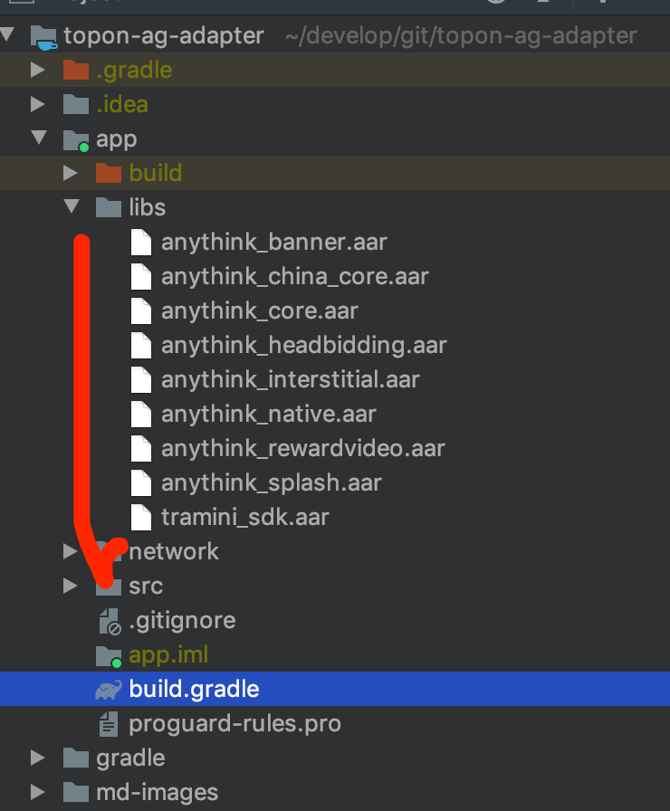
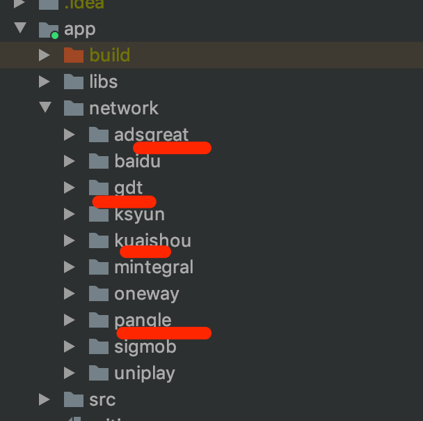
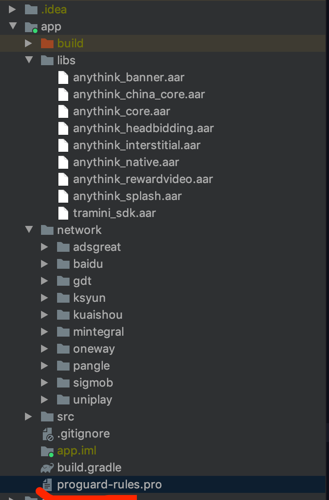
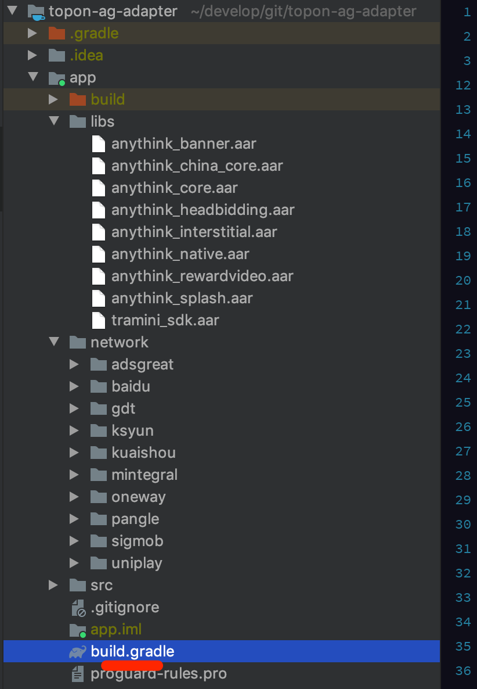
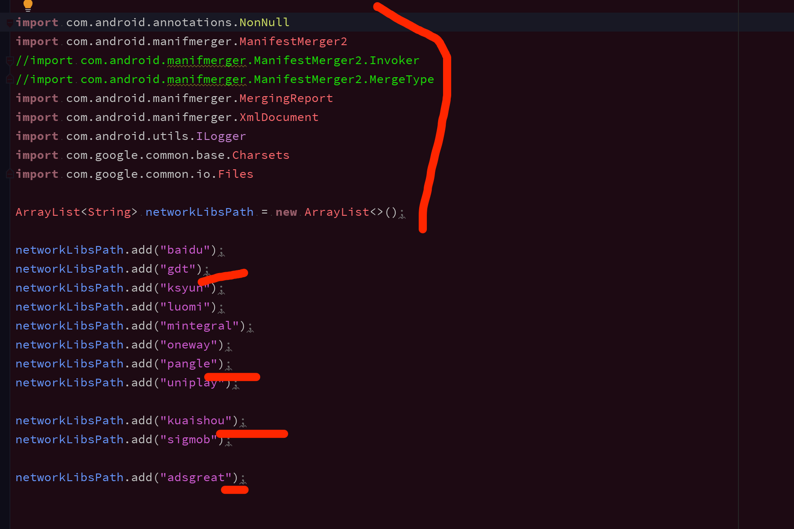
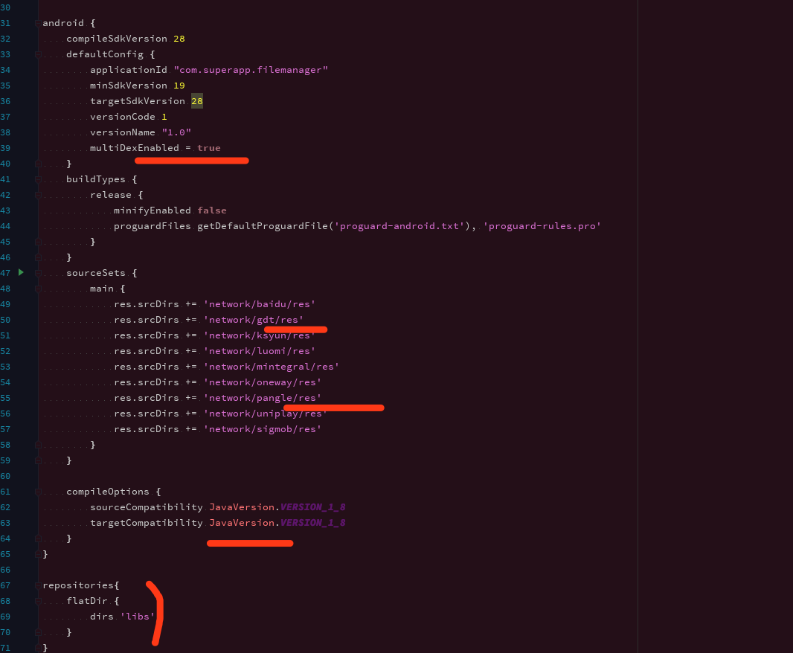
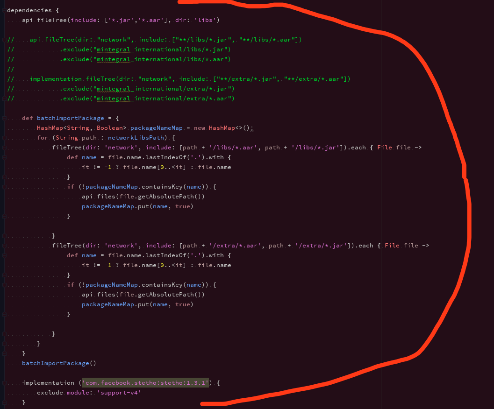
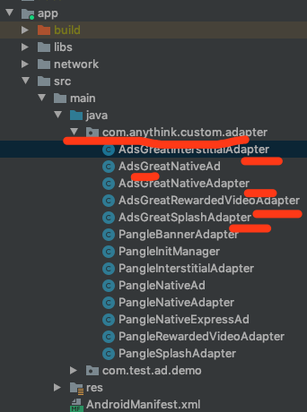
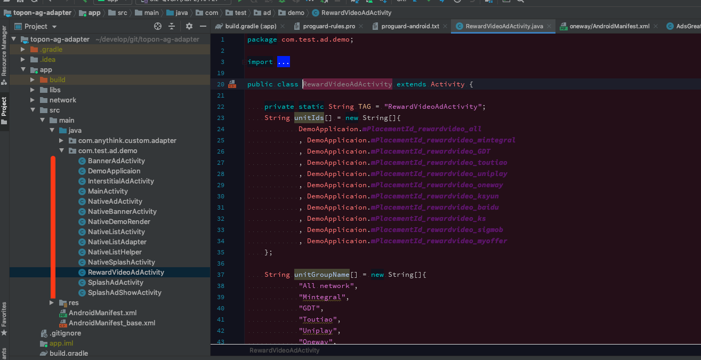

# topon接入步骤

1. 导入libs下的aar包,主项目下新建libs文件夹,主项目下的build.gradle文件下加入以下代码：

   ```groovy
   dependencies {
   	api fileTree(include: ['*.jar','*.aar'], dir: 'libs')
   }
   ```



2. 在主项目目录下新建network目录，复制以下四个包，加入，穿山甲pangle 优量汇gdt 快手kuaishou 还有adsgreat

   

3. 复制内容到主项目的progurad配置文件里，一样的覆盖不一样的添加

   

4. 添加主项目的build.gradle配置

   


   * 添加以下内容（参考哦红线标记处）

     

   * 继续添加（参考哦红线标记处）

     

   * 继续添加（参考哦红线标记处），往下未显示完的内容全部添加

     

5. 新建包名com.anythink.custom.adapter，在此包下复制以AdsGreat为前缀的类文件至新建的包下

   

6. 然后在主项目的proguard-rules.pro下加入以下内容

   ```properties
   -keep class com.anythink.custom.** {*;}
   ```

* 至于各种类型的广告接入，布局等实现，参考demo下的代码

  